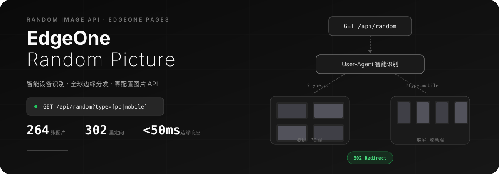

<p align="center">
  
</p>

<p align="center">
  <a href="https://picture.tianhw.top/"><strong>🔗 在线演示</strong></a> ·
  <a href="https://picture.tianhw.top/api/random">随机一张</a> ·
  <a href="https://picture.tianhw.top/gallery">图库预览</a>
</p>

---

## 它是什么

一个部署在 EdgeOne Pages 上的**随机图片 API 服务**。放入图片，获得一个 URL——每次请求返回一张随机图片，自动适配访问者设备。

```bash
# 在浏览器、Markdown、或任何需要随机图片的地方直接使用
https://picture.tianhw.top/api/random
```

## 工作原理

```text
请求 /api/random
    │
    ├─ ?type=pc      → 随机横屏图片 → 302 重定向
    ├─ ?type=mobile  → 随机竖屏图片 → 302 重定向
    └─ 无参数        → User-Agent 识别设备 → 自动匹配
```

- **横屏图片**（宽 > 高）自动归类为 PC 端素材
- **竖屏图片**（高 ≥ 宽）自动归类为移动端素材
- 图片元数据在构建时生成，运行时无文件系统开销

## 特性

| 能力 | 说明 |
|------|------|
| 智能分发 | 基于 User-Agent 自动识别设备，推送适配尺寸的图片 |
| 全球加速 | EdgeOne 边缘节点分发，静态资源一年强缓存 |
| 沉浸式图库 | 瀑布流布局 + Lightbox 预览 + GSAP 动画 |
| 零配置 | 图片放入目录即可，自动扫描、分类、生成缩略图 |
| JSON 模式 | `?redirect=false` 返回结构化 JSON，方便程序调用 |

## 快速开始

### 1. 放入图片

将图片放入 `public/images/` 目录：

- 支持 `.jpg` `.png` `.gif` `.webp` `.bmp` `.tiff`
- 支持子目录分类，系统递归扫描
- 无需重命名，自动按比例分类

### 2. 本地运行

```bash
pnpm install
pnpm dev
```

访问 `http://localhost:3000` 查看首页，`/gallery` 查看图库，`/api/random` 测试 API。

### 3. 部署到 EdgeOne Pages

[](https://edgeone.ai/pages/new?repository-url=https://github.com/H2O-ME/EdgeOne-Random-Picture)

| 配置项 | 值 |
|--------|------|
| 框架预设 | `Next.js` |
| 构建命令 | `npm run build` |
| 输出目录 | `.next` |

## API 参考

| 端点 | 说明 | 响应 |
|------|------|------|
| `GET /api/random` | 随机图片（自动识别设备） | `302` 重定向到图片 |
| `GET /api/random?type=pc` | 随机横屏图片 | `302` 重定向 |
| `GET /api/random?type=mobile` | 随机竖屏图片 | `302` 重定向 |
| `GET /api/random?redirect=false` | JSON 格式返回 | `{"url","width","height","size"}` |
| `GET /gallery` | 图库页面 | HTML |

**JSON 响应示例：**

```json
{
  "url": "/images/621.webp",
  "width": 1536,
  "height": 864,
  "size": "259.64 KB"
}
```

## 技术栈

- **框架**：Next.js 16 (App Router, Turbopack)
- **样式**：Tailwind CSS 4
- **动画**：GSAP + @gsap/react
- **图片处理**：sharp（缩略图）+ image-size（元数据）
- **部署**：EdgeOne Pages

## 许可证

[MIT](LICENSE) © THW
